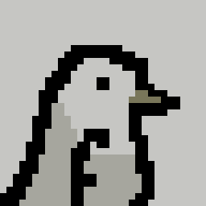

<p align="center">
  
</p>

# flock

**let your agents loose.**

[divagation.github.io/flock](https://divagation.github.io/flock/)

flock is a tiny, beautiful macOS app that lets you run as many Claude Code sessions as you want, all at once, all in one window. watch them think, read, edit, and build in real time. it's like having a team of programmers that never sleeps.

you open flock. you press `⌘T` a few times. suddenly four claudes are working on four different things and you're just... watching. it's kind of mesmerizing honestly.

<br>

## get it

```bash
brew tap divagation/flock
brew install --cask flock
```

or grab the `.zip` from [releases](https://github.com/Divagation/flock/releases) and drag it into Applications. done.

<br>

## what you get

🪟 **panes that just work.** they tile themselves. 1 pane fills the screen, 2 panes split in half, 4 make a grid. it figures it out. split horizontal, split vertical, maximize one, whatever you want.

🤖 **agent mode.** this is the fun one. hit `⌘⇧A` and flock becomes a task manager. throw tasks at it, watch them flow across a kanban board (backlog → in progress → done). each agent gets a live timeline showing every file it reads, every edit it makes, every command it runs.

⌨️ **command palette.** `⌘K` opens everything. new panes, themes, layouts, broadcast mode. if you've used raycast or arc you already know how this works.

📡 **broadcast mode.** type once, every pane hears it. useful for when you want all your claudes to know something at the same time.

🔍 **find everywhere.** search inside one pane or across all of them at once.

💾 **session restore.** close the app, open it later, everything's still there.

🎨 **themes.** because life's too short for one color scheme.

🔔 **notifications.** flock taps you on the shoulder when an agent finishes something.

<br>

## keyboard shortcuts

flock is keyboard-first. your hands never leave the keys.

| | |
|---|---|
| `⌘T` | new claude |
| `⌘⇧T` | new shell |
| `⌘W` | close pane |
| `⌘1`–`⌘9` | jump to pane |
| `⌘←→↑↓` | navigate panes |
| `⌘↩` | maximize / restore |
| `⌘D` | split horizontal |
| `⌘⇧D` | split vertical |
| `⌘K` | command palette |
| `⌘⇧A` | agent mode |
| `⌘⇧B` | broadcast mode |
| `⌘F` | find in pane |
| `⌘⇧F` | find in all panes |

<br>

## build it yourself

you'll need xcode (swift 5.9+).

```bash
git clone https://github.com/Divagation/flock.git
cd flock
./build.sh
```

that's it. app goes to `/Applications`, cli goes to `flock`.

<br>

## under the hood

native swift. no electron. each pane is a real terminal powered by [SwiftTerm](https://github.com/migueldeicaza/SwiftTerm). agent mode talks to claude code over `stream-json` and parses every event in real time to build the timelines and kanban board. it's fast because it's not pretending to be a website.

<br>

## why "flock"

a flock of claudes. working together. that's it. that's the name.

<br>

<p align="center">
  <sub>made by <a href="https://github.com/Divagation">divagation</a></sub>
</p>
